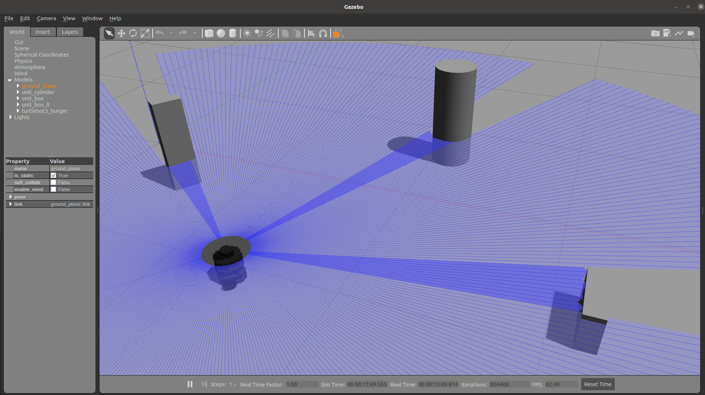
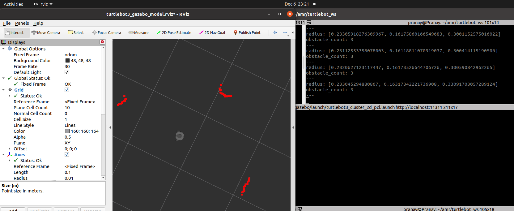

# Obstacle-Detection_clustering_algorithm

[comment]: <>  (## _The Last Markdown Editor, Ever_)

[](https://nodesource.com/products/nsolid)


### Aim : To detect obstacles present in the perception horizon of mobile robot using only 2D Lidar data in an unknown unseen environment.
- find the number of obstacles  present at any given time t.
- also find the approximate size of each obstacle.
- Note: No prior information about the environment is known. (No SLAM Map creation)
### Running simulation:
Pre-requisite: Standard Turtlebot3 packages, built from source. (Refer Turtlebot3's official site for more info!) 
1. Spawn up the custom robot world environment
    ```
    $ roslaunch turtlebot3_gazebo turtlebot3_world_pranay.launch  
    ```
2. Run the ROS node which clusters pointcloud data of the 2-D Lidar and finds the total number of obstacles along with its approximate size:
    ```
    $ roslaunch turtlebot3_gazebo turtlebot3_cluster_2d_pcl.launch 
    ```
3. For visualizing data:
    ```
    $ roslaunch turtlebot3_gazebo turtlebot3_gazebo_rviz.launch   
    ```
4. To View Output Result:\
    For example: In below gazebo environment, robot correctly finds the object count of 3 and publishes its information in /obstacle_info topic. 
    ```
    $ rostopic echo /obstacle_info  
    ```





## Wiki for turtlebot3_simulations Packages
- http://wiki.ros.org/turtlebot3_simulations (metapackage)
- http://wiki.ros.org/turtlebot3_fake
- http://wiki.ros.org/turtlebot3_gazebo

